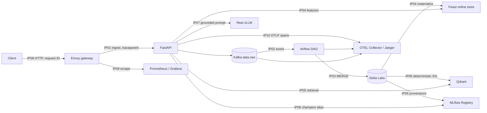

# Submission architecture and ownership

**Owner for every role:** Nguyễn Mạnh Hưng (2A202601829), individual submission.

| Integration point | Boundary | Individual responsibility | Live proof |
|---|---|---|---|
| IP01 | HTTP to Kafka | schema, idempotency key, trace header | Kafka consume evidence |
| IP02 | Kafka to Airflow | DAG run, asset event, retry/DLQ behavior | Airflow run evidence |
| IP03 | Airflow/Spark to Delta | replay-safe merge and time travel | Delta history evidence |
| IP04 | Delta to Feast | snapshot, materialization, online lookup | Feast entity evidence |
| IP05 | Delta to Qdrant | deterministic vector IDs and retrieval | Qdrant search evidence |
| IP06 | Evaluation to MLflow | provenance, champion promotion, rollback | MLflow release evidence |
| IP07 | RAG to vLLM | real vLLM identity, model, metrics | vLLM identity evidence |
| IP08 | Client to Envoy | route, request ID, rate limit | 200/429 gateway evidence |
| IP09 | Components to monitoring | scrape targets, dashboard, alert | Prometheus/Grafana evidence |
| IP10 | Components to tracing | W3C continuity and required spans | Jaeger trace evidence |

The run order is: validate contracts, start the full profile, seed/index/release,
run the golden path and replay, demonstrate a failure/recovery, validate
promotion/rollback, inspect trace and metrics, then capture the evidence pack.
