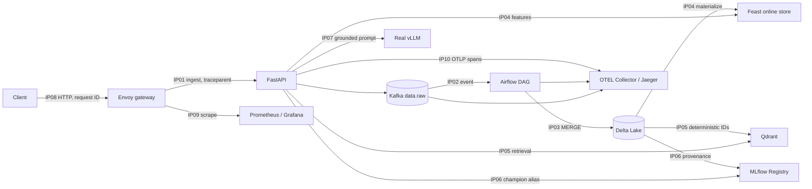

# Kiến trúc và phân công bài nộp

**Chủ sở hữu mọi vai trò:** Nguyễn Mạnh Hưng (2A202601829), bài cá nhân.

| Điểm tích hợp | Ranh giới | Trách nhiệm cá nhân | Evidence |
|---|---|---|---|
| IP01 | HTTP → Kafka | schema, khóa idempotency, trace header | `ip01-kafka-consume.json` |
| IP02 | Kafka → Airflow | DAG, asset event, retry/DLQ | `ip02-airflow-run.json` |
| IP03 | Airflow/Spark → Delta | merge replay-safe, time travel | `ip03-delta-history.json` |
| IP04 | Delta → Feast | snapshot, materialize, online lookup | `ip04-feast-online.json` |
| IP05 | Delta → Qdrant | vector ID xác định, retrieval | `ip05-qdrant-search.json` |
| IP06 | Evaluation → MLflow | provenance, champion, rollback | `ip06-mlflow-release.json` |
| IP07 | RAG → vLLM | identity thật, model, metric | `ip07-vllm-identity.json` |
| IP08 | Client → Envoy | route, request ID, rate-limit | `ip08-gateway.json` |
| IP09 | Components → monitoring | target, dashboard, alert | hai file IP09 |
| IP10 | Components → tracing | W3C continuity, required span | `ip10-trace.json` |

Thứ tự chạy: kiểm tra contract, khởi động full profile, seed/index/release,
chạy golden path và replay, tạo sự cố/khôi phục, kiểm tra promotion/rollback,
kiểm tra trace/metrics, rồi tạo evidence bundle.
